# Mini Anti Cheat V2 - Documentation
## Date: Friday 2 January 2026

### Note:
A video preview of the project can be found in the Files folder

### Documentation:
After completing the last project “Mini Anti Cheat” I was researching on ways to improve it, since Anti Cheats have tons of features not just blocking blacklisted apps of course. I had multiple features in mind, I asked Gemini about what could be the best next step and it told me to add “Handle Stripping”. It said that cheats don't only rely on blacklisted apps, but they might use unknown apps or custom ones that request a handle to the game and have full access to its memory. So the Anti-Cheat needs to intercept those requests and prevent granting permissions to those cheats. And with that, I started with the feature.

I divided the implementation of this feature into 2 parts: getting the game process ID, and actually shielding it.

**Part 1 - Getting the Game's Process ID:**  
I added these to the header:  
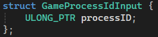

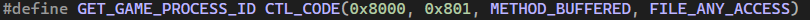

These to the main driver:  
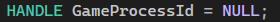

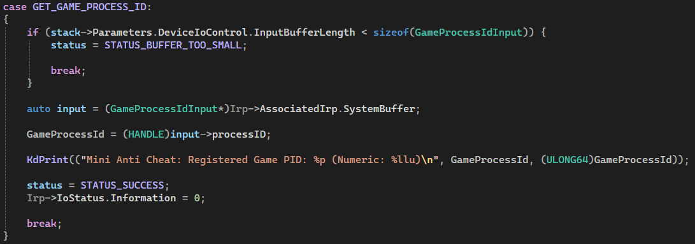

And this to the main game:  
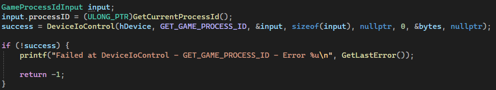

**Code Explanation:**  
I needed to make the driver know the game's process ID to be able to protect it. So to do that, I need to get the process ID in user mode, and send it to the driver. So I started with defining a new IOCTL request in the header to send that ID, and a new struct to hold it from user mode to the driver.

After that, in the driver, I defined a new global variable called GameProcessId to have the process ID. Then, I implemented a new case for the new request in the DeviceControl function. The case basically starts by checking the size of the input buffer and comparing it to the struct defined in the header. If the size is smaller than the struct, we return status buffer too small and break the execution. If the size is fine, I defined an input variable to store the data coming from the user mode app, and then I stored this data in the global variable GameProcessId, printed a statement to indicate that, and then completed the request.

Finally, in user mode, I initialized a variable “input” of type GameProcessIdInput which I defined in the header to send the ID from user mode to the driver. I assigned the Process ID to it and called the new IOCTL request to send it to the driver. After that, I checked for the success of the request.

**Part 2 - Shielding the Game:**  
Added to the driver:  
New Global Variable:  
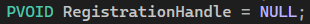

In DriverEntry:  
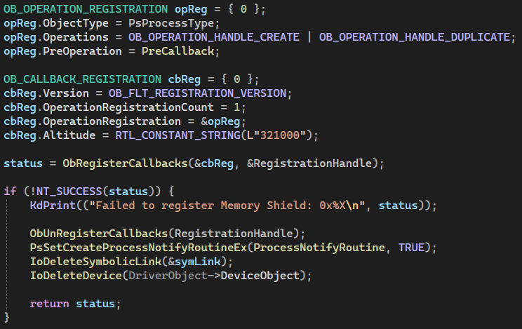

New Function:  
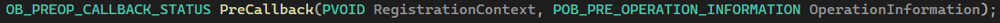

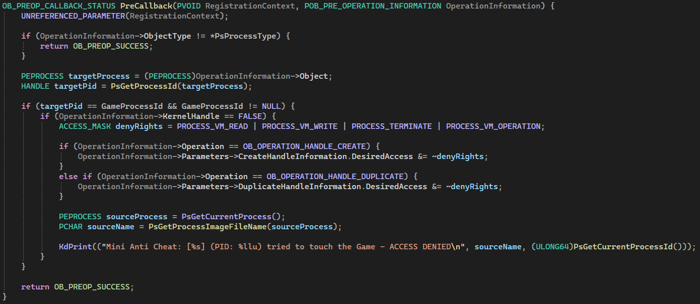

Added to the Header:  
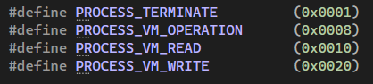

**Code Explanation:**  
This part was complicated for me, and still till now, I haven't fully understood the concept. The code is written after a long research and help from Gemini. The main idea of it is that we're intercepting any process that is requesting a handler to the game, making sure that the process ID they want is the same as the Game Process ID, if yes, then we take away rights so they don't mess with the game's memory. And then I printed a little statement to show which process was trying to request a handler.

**!! UPDATE - Tuesday, January 6th 2026 !!**  
I spent the time researching this algorithm more and I finally understand fully what it does and why it is the way it is.

**The code in DriverEntry:**  
First we are initializing a structure of type OB_OPERATION_REGISTRATION to define what specific actions we want to filter. Setting it to 0 is a safely measure to prevent junk data in memory from causing crashes.

Then we are telling Windows that we are only interested in Process objects (so in this case, we are ignoring Threads, Files, or Registry Keys). Then we are defining what actions should trigger our function, in this case we want creation (Open Process) and duplication of our process. Then we specify the function that needs to run before the handle is granted.

After that, we initialized a container that will hold all our registration sets (cbReg). Then we define the version of the callback system we are using, this is required for compatibility. Then we need to how many registrations we want, in this case it's only 1 which is the opReg we just made. Then we point to that structure, and finally we set the altitude which is basically the priority of the driver. 321000 is a very high priority, basically the same category as Anti-Viruses and File System drivers.

Finally, calling ObRegisterCallbacks will basically activate everything we've set.

**Now regarding the function itself:**  
This function will run each time a process tries to touch any other process.

First we told the compiler that we don't to use the RegistrationContext parameter.

Then, we're doing let's call it a sanity check, basically if by any chance Windows sent something that isn't a process, we ignore it and return success we means to just carry on.

Now if we have a process, if take it and assign it to targetProcess so the kernel knows that it's a process object, and we get its Process ID.

Then, we need to check if this target process ID is the same as the game's process Id, if yes, then they are touching the game, if not then no and we don't have to do anything with. But if yes, then we proceed with the next step.

Before doing anything, we need to check if this request is coming from user mode or kernel mode, since we don't want to intercept Windows since that will cause a BSOD. If it's not kernel mode which means it's a user mode app, we need to remove the permissions that app requested. So first, we define a list of permissions to remove. Then we check if the operation was create or duplicate, in either cases we will remove the permissions by using the NOT AND bitwise operator "~". This operator basically inverts the bits of something, if it is 1, it becomes 0 and the opposite. So if the app was requesting a write permission, not it will not have it and so on.

After that, just for clarity, I got the name of the process trying to access the game and printed it.

At the end, we return a success status.

Now after I understood this function, I've notice something.. The function is skipping kernel mode and only preventing user mode, doesn't that mean that a hacker can make a custom made kernel mode driver and bypass this function? I think the answer is definitely yes.

**!! END OF UPDATE !!**

After that, I tested everything in the VM, but the test didn't go well. I tried closing the game using Task Manager, the CMD windows closed but the game itself didn't close since Task Manager got access denied. So now the game is still running but I can't close it since I don't have the CMD window open. And I can't close it in the Task Manager either. And as the game can't be closed, the driver itself can't be stopped since the game is still attached to it. And with that I had a game and a driver that can never be closed. I restarted the VM, and started thinking of a solution for that problem, after a short time, I came up with the solution.

The solution was to basically break the shield if the game stops, crashes, or anything bad happens to it. So I started by making this new IOCTL request:
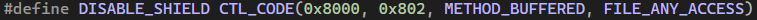

And added the logic in DeviceControl in the driver:  
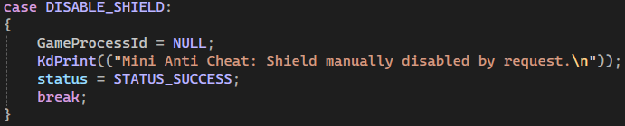

Basically, drop the process ID to stop shielding it.

I added this to the DriverUnload function to unregister the shield:  
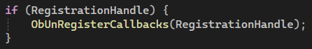

And this to the MiniAntiCheatClose function to also drop the shield:  
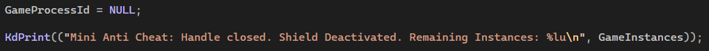

And I added this to the Game to call the new request on closing the app:  
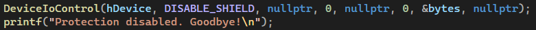

With these changes, the problem is now gone and the project works perfectly!

This was the new version. Now, I'll just spend my time researching the shielding algorithm to fully comprehend it. When I'm done, I'll add some new features to the Anti-Cheat, and maybe even make an actual small game and connect it to the driver instead of relying on the dummy user mode app.